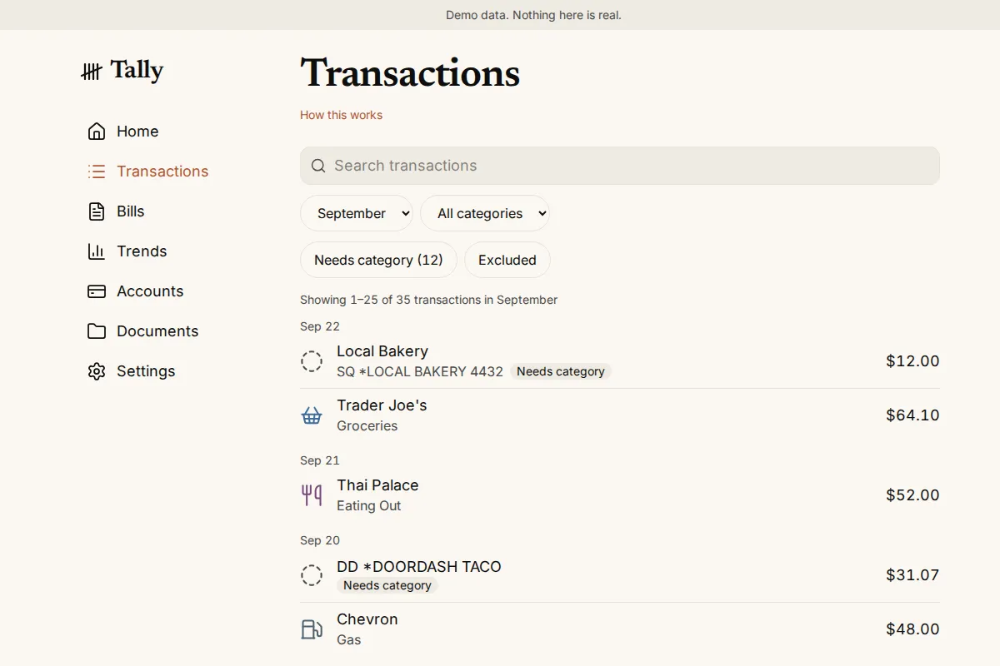
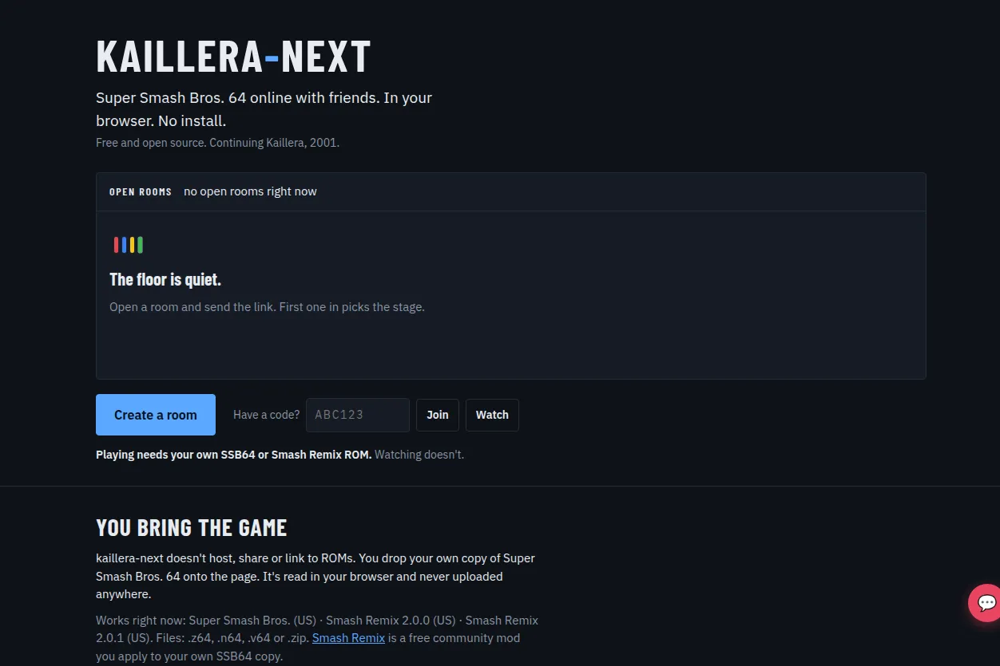

### Kazon Wilson

Software engineer building with AI. Seven years of Python, PostgreSQL and AWS at Lyft, Skupos, Sure, Axuall and Scotch.

**Start here: [thesuperhuman.us](https://thesuperhuman.us)**

**Building now**

- [Tally](https://thesuperhuman.us/building/tally/): a budgeting app, and the first product of my own I'm working to ship. It's for more than my family; they're just the first to use it. [Code](https://github.com/kwilson21/tally).
- [kaillera-next](https://github.com/kwilson21/kaillera-next): browser-based N64 netplay over WebRTC.

  
  

**Selected work**

- Led a 40,000-record financial data migration at Lyft, with a dry-run audit that caught a duplicate-charge edge case before it shipped.
- Scaled a Lyft bonus-remediation tool from 5,000 to 100,000+ rows per batch and gave support Grafana dashboards to run it themselves.
- Built per-state Dagster pipelines ingesting medical-board credentialing data over SFTP, REST and Selenium.

**Open to full-time and contract roles.** [LinkedIn](https://www.linkedin.com/in/kazonwilson/) · kazon.wilson@thesuperhuman.us
